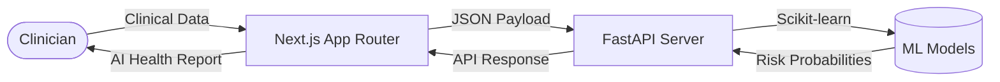

<div align="center">

# 🩺 HealthRisk AI

**A production-grade, full-stack Healthcare AI platform for predictive clinical analytics and financial risk estimation.**

[](https://nextjs.org/)
[](https://fastapi.tiangolo.com/)
[](https://www.python.org/)
[](https://scikit-learn.org/)
[](https://opensource.org/licenses/MIT)

*Transforming scattered clinical data into actionable, real-time insights.*

---

</div>

## 📖 Project Description

HealthRisk AI is an advanced SaaS-style dashboard that predicts the likelihood of cardiovascular disease, type-2 diabetes, and estimates medical insurance premiums. 

Designed for healthcare professionals, data analysts, and researchers, the platform combines a lightning-fast asynchronous **FastAPI** backend with a visually stunning, glassmorphism-styled **Next.js** frontend. It leverages pre-trained **Scikit-learn** machine learning models to provide sub-millisecond inference, aggregating results into comprehensive AI Health Reports.

## ✨ Features

- **🧠 Multi-Model AI Engine**: Simultaneously predicts Heart Disease (Random Forest), Diabetes (Gradient Boosting), and Insurance Costs (Linear Regression).
- **📊 Interactive Analytics**: Real-time Recharts-powered data visualization (Radar, Area, Scatter, Pie).
- **🔬 HealthRisk Lab Simulator**: Stress-test hospital and insurance portfolios against macro scenarios (e.g., Global Pandemics, Drug Approvals).
- **🎨 Premium UI/UX**: Dark-themed, glassmorphism design system built with Tailwind CSS and Framer Motion micro-animations.
- **⚡ Decoupled Architecture**: Highly scalable RESTful API design ensuring strict data validation via Pydantic.

## 🏗️ Architecture



## 📂 Folder Structure

```text
HealthRiskAI/
├── backend/               # FastAPI Server, Pydantic Models, API Routes
│   ├── models/            # Serialized .pkl ML Models
│   └── data/              # CSV Datasets
├── frontend/              # Next.js 16 Frontend
│   ├── app/               # Pages (Dashboard, Predict, Analytics, Simulation, Report)
│   └── components/        # Reusable UI Components (GlassCards, Charts)
├── docs/                  # Detailed Project Documentation
├── assets/                # Screenshots and Diagrams
└── .github/               # Issue and PR Templates
```

## 🛠️ Technology Stack

- **Frontend**: Next.js 16 (App Router), React 19, TypeScript, Tailwind CSS 4, Framer Motion, Recharts.
- **Backend**: FastAPI, Uvicorn, Python 3.13, Pydantic.
- **Machine Learning**: Scikit-learn, Pandas, NumPy, Joblib.

## 🚀 Installation & Setup

### 1. Clone the repository
```bash
git clone https://github.com/alchemist-sourav/HealthRiskAI.git
cd HealthRiskAI
```

### 2. Run the Backend (FastAPI)
```bash
cd backend
python -m venv venv
# Windows: .\venv\Scripts\Activate.ps1
# Mac/Linux: source venv/bin/activate
pip install -r requirements.txt
uvicorn app:app --reload
```
*API Docs available at: `http://127.0.0.1:8000/docs`*

### 3. Run the Frontend (Next.js)
Open a new terminal window:
```bash
cd frontend
npm install
cp ../.env.example .env.local
npm run dev
```
*Frontend available at: `http://localhost:3000`*

## 📚 Documentation Directory

Explore the `docs/` folder for in-depth technical specifications:
- [Architecture & Flow](docs/ARCHITECTURE.md)
- [Machine Learning Models](docs/ML_MODELS.md)
- [API Documentation](docs/API_DOCUMENTATION.md)
- [Datasets & Preprocessing](docs/DATASETS.md)
- [Presentation Guide](docs/PRESENTATION_GUIDE.md)

## 🔮 Future Scope

- Integration with wearable IoT devices (Apple Watch, Fitbit) for continuous vitals monitoring.
- LLM (Large Language Model) integration for automated clinical note summarization.
- Role-Based Access Control (RBAC) separating Doctor, Patient, and Admin portals.

## 🤝 Contributors

Built end-to-end by a single full-stack ML engineer as a capstone project. Contributions are welcome! Please read the [Contributing Guidelines](CONTRIBUTING.md) and check out the [Issue Templates](.github/ISSUE_TEMPLATE) before submitting a Pull Request.

## 📄 License

This project is licensed under the [MIT License](LICENSE).
