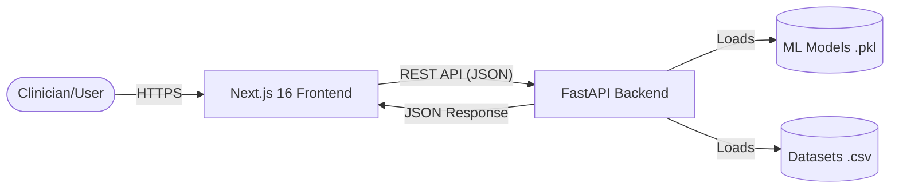
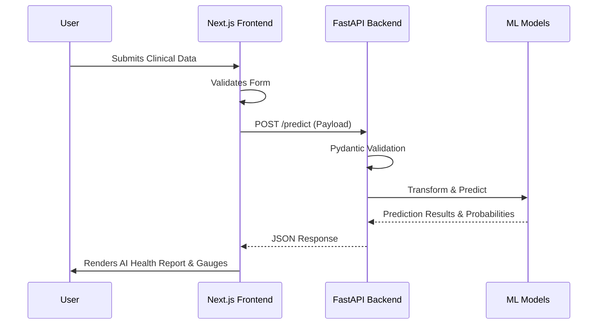

# Architecture

HealthRisk AI is built using a modern, decoupled architecture. This ensures that the frontend presentation layer and the backend machine learning execution layer can scale, fail, and be deployed independently.

## High-Level Architecture Diagram



## Frontend (Next.js 16)

The frontend is a Server-Side Rendered (SSR) and statically generated React application using the **App Router**.
- **Styling:** Tailwind CSS 4 with custom glassmorphism utilities and global CSS variables.
- **Animations:** Framer Motion is used for layout transitions, animated counters, and dropdowns.
- **State Management:** React Hooks (`useState`, `useEffect`) manage form state and API data fetching.
- **Data Visualization:** Recharts powers the interactive analytics (Radar, Area, Bar, Scatter, Pie).

## Backend (FastAPI)

The backend is a high-performance Python ASGI framework.
- **API Routing:** RESTful endpoints for each prediction model (`/predict/heart`, `/predict/diabetes`, `/predict/insurance`).
- **Data Validation:** Pydantic models strictly enforce the shape and type of incoming JSON payloads.
- **ML Pipeline:** Pre-trained Scikit-learn models are loaded into memory on startup using `joblib` for sub-millisecond inference times.

## Prediction Flow



## Folder Structure

```text
HealthRiskAI/
├── backend/
│   ├── app.py             # FastAPI application and routes
│   ├── models/            # Saved .pkl ML models
│   ├── data/              # Source datasets
│   ├── requirements.txt   # Python dependencies
│   └── scripts/           # Training scripts (Jupyter/Python)
├── frontend/
│   ├── app/               # Next.js App Router pages
│   ├── components/        # Reusable React components (UI & Layout)
│   ├── lib/               # Utility functions and API client
│   ├── public/            # Static assets
│   ├── tailwind.config.ts # Tailwind configuration
│   └── package.json       # Node dependencies
└── docs/                  # Project documentation
```
